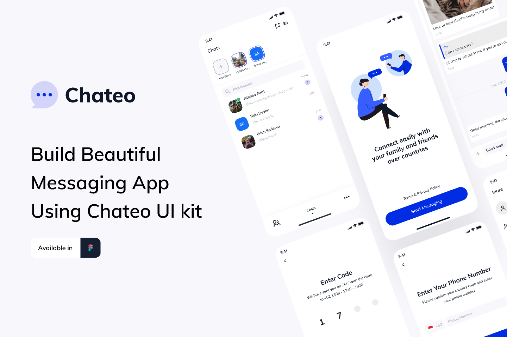

# Chateo 🔒

**Secure End-to-End Encrypted Messaging App**  
*By Group 5 - Cyprus International University Capstone Project*

---

## 📱 About Our Project
We're a team of 5 CIU students developing **Chateo**, an Android/iOS messaging app with military-grade encryption, built using Flutter. Our capstone project focuses on creating secure communication channels while maintaining an intuitive user experience.



## 🛠️ Features
- **AES-256 Encrypted Messaging** 🔐 
  All messages secured with advanced encryption standards
- **Real-Time Chat** 💬  
  Instant message delivery with read receipts
- **Secure Authentication** 🔑  
  Firebase-based user verification
- **Modern UI** 🎨 
  Clean, intuitive interface built with Flutter
- **Multi-Platform Support** 📱  
  Android and iOS compatibility

## 🧑💻 Development Team
| Name                  | Student ID | Role                          | Responsibilities               |
|-----------------------|------------|-------------------------------|---------------------------------|
| Abdulqani Ahmed       | 22113807   | Backend Architect 🖥️         | Socket Programming & API Design|
| Yousef Mohammed Ahmed | 22113415   | Security Engineer 🛡️         | Encryption Implementation      |
| Abdiaziz Mohamed Omar | 22114594   | Database Specialist 🗄️       | Firebase Integration & DB Design|
| Suhayb Dahir Ahmedegeh| 22120124   | UI/UX Designer 🎯            | Interface Design & Prototyping |
| Fardowso Adem Omar    | 22103021   | Frontend Developer ✨         | Flutter UI Implementation      |

---

**Made with ❤️  - Cyprus International University** 🎓 

## 🔧 Technology Stack


```yaml
dependencies:
  flutter: 
    sdk: flutter
  firebase_core: ^2.15.0
  encrypt: ^5.0.1
  socket_io_client: ^2.0.2
  cached_network_image: ^3.3.0